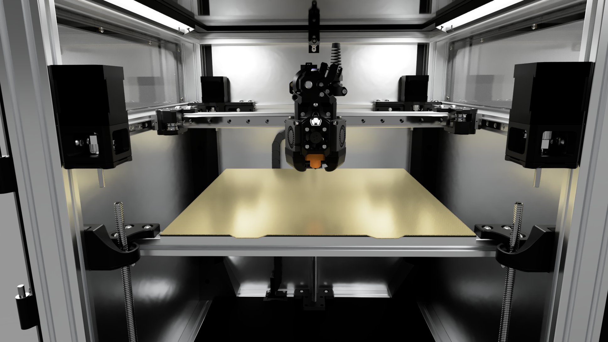

[![CC BY-NC-SA 4.0][cc-by-nc-sa-shield]][cc-by-nc-sa]

# System: Noir
This is a small project of mine to create a version of the Voron Trident that stayed warm, looked cool, and had plenty of motion capability for fast printing. It's not perfect, but I hope it gives you some inspiration for your own projects!

Only the 3D files are provided - this is not intended to be a build guide.

Credit to the amazing people who designed the parts I used in this build:

* Monolith Gantry: [Monolith_Gantry_V2-VT by CloakedWayne](https://github.com/CloakedWayne/Monolith_Gantry_V2-VT)
* Xol Toolhead: [Xol-Toolhead by Armchair Heavy Industries](https://github.com/Armchair-Heavy-Industries/Xol-Toolhead)

And of course, the Voron Team for their excellent base:

* Voron Trident: [Voron-Trident by VoronDesign](https://github.com/VoronDesign/Voron-Trident)

 

* [More Images of Completed Build!](docs/assets/images)
  
Project lead: [Sinakaru1](https://github.com/Sinakaru1)

This work is licensed under a
[Creative Commons Attribution-NonCommercial-ShareAlike 4.0 International License][cc-by-nc-sa].

[![CC BY-NC-SA 4.0][cc-by-nc-sa-image]][cc-by-nc-sa]

[cc-by-nc-sa]: http://creativecommons.org/licenses/by-nc-sa/4.0/
[cc-by-nc-sa-image]: https://licensebuttons.net/l/by-nc-sa/4.0/88x31.png
[cc-by-nc-sa-shield]: https://img.shields.io/badge/License-CC%20BY--NC--SA%204.0-lightgrey.svg
